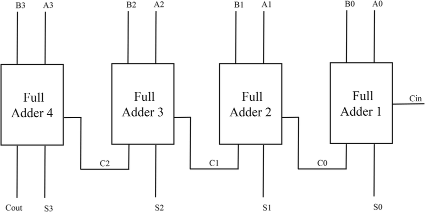
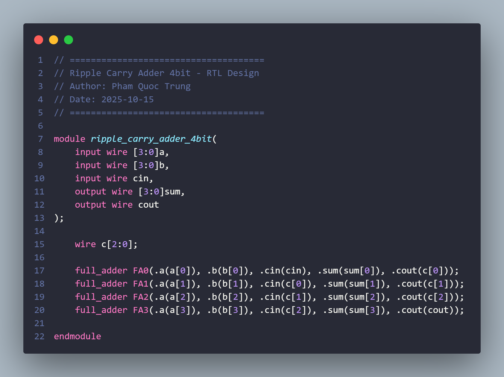
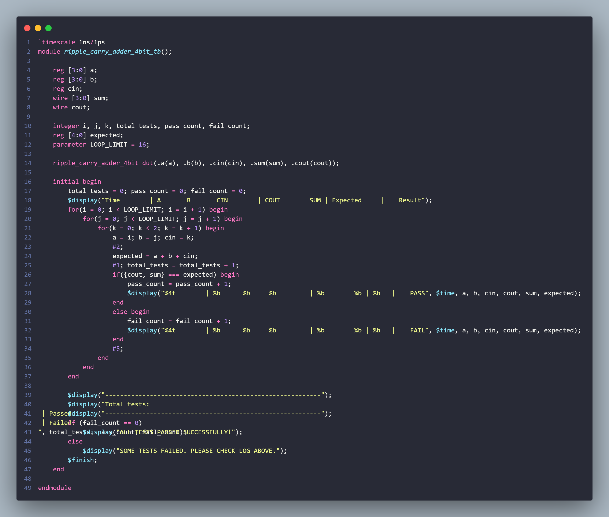
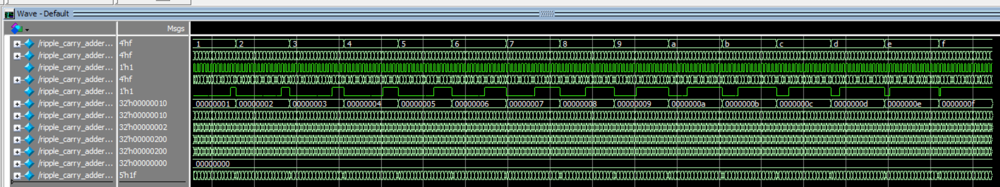
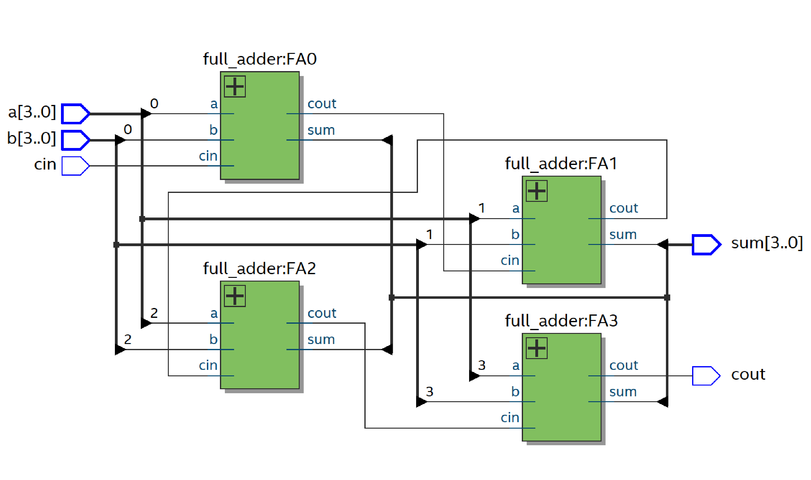
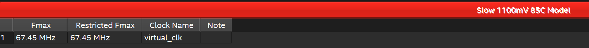
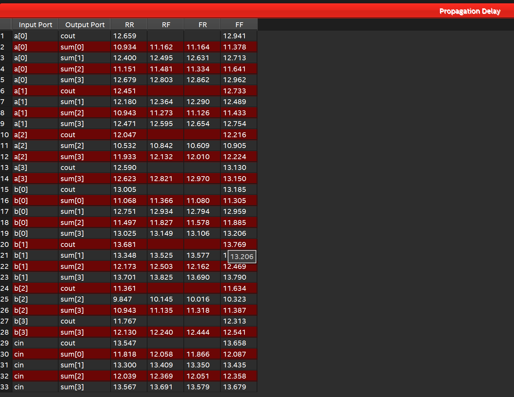

# 4-bit Ripple-Carry Adder

A structural 4-bit ripple-carry adder built from four 1-bit full adders. The project includes exhaustive functional verification and an Intel Quartus educational implementation flow.

## Design status

| Item | Status |
|---|---|
| Hierarchical RTL | Implemented |
| Exhaustive self-checking testbench | Implemented (512 combinations) |
| Quartus project/reports | Included |
| Timing constraints | Included |

## Specification

| Property | Value |
|---|---|
| Design type | Combinational arithmetic datapath |
| Operand width | 4 bits |
| Function | `{cout, sum} = a + b + cin` |
| Latency | Combinational; no clock cycles |
| Core module | `ripple_carry_adder_4bit` |
| FPGA wrapper | `top_ripple_carry_adder` |

### Interface

| Port | Direction | Width | Description |
|---|---|---:|---|
| `a` | Input | 4 | First operand |
| `b` | Input | 4 | Second operand |
| `cin` | Input | 1 | Carry input |
| `sum` | Output | 4 | Low four result bits |
| `cout` | Output | 1 | Final carry |

## Architecture

```text
cin -> FA0 -> c0 -> FA1 -> c1 -> FA2 -> c2 -> FA3 -> cout
        |sum0       |sum1       |sum2       |sum3
```

Each full adder calculates one result bit. The critical combinational path may pass through all four carry stages; this simple regular structure trades speed for low design complexity.





## Repository structure

```text
.
├── src/
│   ├── full_adder.v
│   ├── ripple_carry_adder_4bit.v
│   └── top_ripple_carry_adder.v
├── sim/
│   ├── ripple_carry_adder_4bit_tb.v
│   └── run.tcl
├── constraints/ripple_carry_adder_4bit.sdc
├── quartus_project/
├── results/sim/
└── images/
```

## Verification

The self-checking testbench exhaustively iterates through:

```text
a   : 0 to 15
b   : 0 to 15
cin : 0 to 1
```

It compares `{cout, sum}` with a 5-bit behavioral reference. Total expected cases: `16 x 16 x 2 = 512`.

```text
Total tests: 512 | Passed: 512 | Failed: 0
```






### Run with Questa/ModelSim

```bash
vsim -do sim/run.tcl
```

Or:

```tcl
vlib work
vlog src/full_adder.v src/ripple_carry_adder_4bit.v
vlog sim/ripple_carry_adder_4bit_tb.v
vsim -c work.ripple_carry_adder_4bit_tb -do "run -all; quit -f"
```

## Synthesis and timing







For a wider or higher-frequency datapath, compare the ripple architecture with CLA or parallel-prefix adders. Do not extrapolate the committed timing report to a different FPGA or ASIC library.
